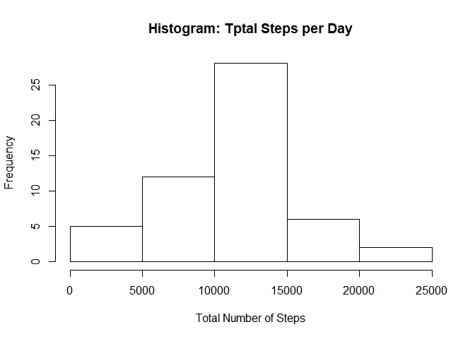
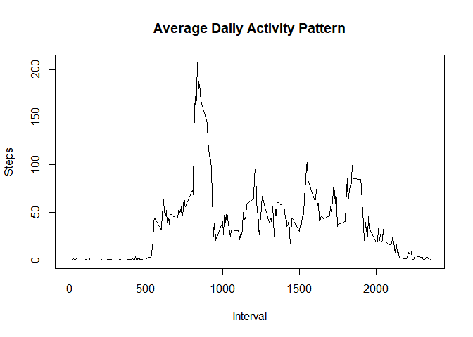
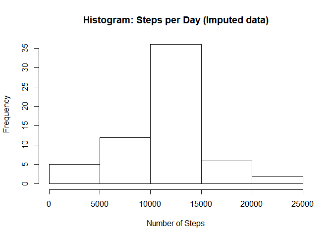
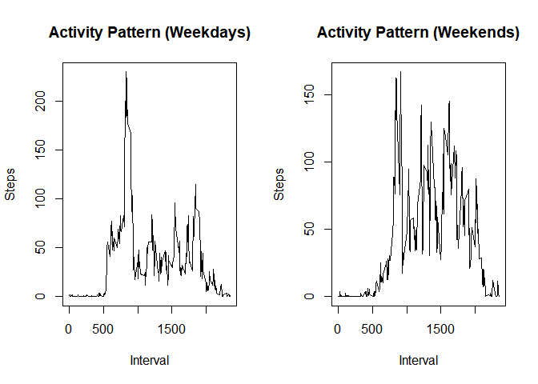

##About This was the first project for the Reproducible Research course in Coursera's Data Science specialization track. The purpose of the project was to answer a series of questions using data collected from a FitBit.


```r
setwd("D:/CourseraDataSciences/reproducible_research/Week2/RepData_PeerAssessment1")

knitr::opts_chunk$set(echo = TRUE, cache = FALSE)
```

## Loading and preprocessing the data


```r
activity <- read.csv("activity.csv", header = TRUE)
```

# What is mean total number of steps taken per day?


```r
StepsPerDay <- tapply(activity$steps, activity$date, sum)
```

##Make a histogram of the total number of steps taken each day


```r
hist(StepsPerDay, xlab = "Total Number of Steps", main = "Histogram: Tptal Steps per Day")
```

<!-- -->

##calculate and report the mean and median of the total number of steps taken per day


```r
MeanPerDay <- mean(StepsPerDay, na.rm = TRUE)
MedianPerDay <- median(StepsPerDay, na.rm = TRUE)
```

Mean Per day


```r
MeanPerDay
```

```
## [1] 10766.19
```

Median per day


```r
MedianPerDay
```

```
## [1] 10765
```

# What is the average daily activity pattern?

## Make a time series plot of the 5-minute interval and the average number of steps taken, averaged across all days


```r
StepsPerInterval <- tapply(activity$steps, activity$interval, mean, na.rm = TRUE)
plot(as.numeric(names(StepsPerInterval)), 
	StepsPerInterval, 
	xlab = "Interval", 
	ylab = "Steps", 
	main = "Average Daily Activity Pattern", 
	type = "l")
```

<!-- -->
	
#Which 5-minute interval, on average across all the days in the dataset, contains the maximum number of steps?


```r
maxInterval <- names(sort(StepsPerInterval, decreasing = TRUE)[1])
maxSteps <- sort(StepsPerInterval, decreasing = TRUE)[1]

maxInterval
```

```
## [1] "835"
```


#Inputing missing values

#Calculate and report the total number of missing values in the dataset


```r
NA.vals <- sum(is.na(activity$steps))
```

#Devise a strategy for filling in all of the missing values in the dataset.
#I will fill in missing data with the mean number of steps across all days with available data for that particular interval.
#Create a new dataset that is equal to the original dataset but with the missing data filled in.


```r
StepsPerInterval <- tapply(activity$steps, activity$interval, mean, na.rm = TRUE)
```


# split activity data by interval


```r
activity.split <- split(activity, activity$interval)
```

# fill in missing data for each interval


```r
for(i in 1:length(activity.split)){
	activity.split[[i]]$steps[is.na(activity.split[[i]]$steps)] <- StepsPerInterval[i]
}
activity.imputed <- do.call("rbind", activity.split)
activity.imputed <- activity.imputed[order(activity.imputed$date) ,]
```

#Make a histogram of the total number of steps taken each day and Calculate and report the mean and median total number of steps taken per day.


```r
StepsPerDay.imputed <- tapply(activity.imputed$steps, activity.imputed$date, sum)
hist(StepsPerDay.imputed, xlab = "Number of Steps", main = "Histogram: Steps per Day (Imputed data)")
```

<!-- -->

```r
MeanPerDay.imputed <- mean(StepsPerDay.imputed, na.rm = TRUE)
MedianPerDay.imputed <- median(StepsPerDay.imputed, na.rm = TRUE)
```

# Are there differences in activity patterns between weekdays and weekends?
##Create a new factor variable in the dataset with two levels - ?weekday? and ?weekend? indicating whether a given date is a weekday or weekend day.


```r
activity.imputed$day <- ifelse(weekdays(as.Date(activity.imputed$date)) == "Saturday" | weekdays(as.Date(activity.imputed$date)) == "Sunday", "weekend", "weekday")
```

# Make a panel plot containing a time series plot of the 5-minute interval and the average number of steps taken, averaged across all weekday days or weekend days.
## Calculate average steps per interval for weekends


```r
StepsPerInterval.weekend <- tapply(activity.imputed[activity.imputed$day == "weekend" ,]$steps, activity.imputed[activity.imputed$day == "weekend" ,]$interval, mean, na.rm = TRUE)
```

##Calculate average steps per interval for weekdays


```r
StepsPerInterval.weekday <- tapply(activity.imputed[activity.imputed$day == "weekday" ,]$steps, activity.imputed[activity.imputed$day == "weekday" ,]$interval, mean, na.rm = TRUE)
```


##Calculate average steps per interval for weekends


```r
StepsPerInterval.weekend <- tapply(activity.imputed[activity.imputed$day == "weekend" ,]$steps, activity.imputed[activity.imputed$day == "weekend" ,]$interval, mean, na.rm = TRUE)
```

##Calculate average steps per interval for weekdays


```r
StepsPerInterval.weekday <- tapply(activity.imputed[activity.imputed$day == "weekday" ,]$steps, activity.imputed[activity.imputed$day == "weekday" ,]$interval, mean, na.rm = TRUE)
```

## Set a 2 panel plot


```r
par(mfrow=c(1,2))

  plot(as.numeric(names(StepsPerInterval.weekday)), 
	StepsPerInterval.weekday, 
	xlab = "Interval", 
	ylab = "Steps", 
	main = "Activity Pattern (Weekdays)", 
      type = "l")

plot(as.numeric(names(StepsPerInterval.weekend)), 
	StepsPerInterval.weekend, 
	xlab = "Interval", 
	ylab = "Steps", 
	main = "Activity Pattern (Weekends)", 
	type = "l") 
```

<!-- -->
